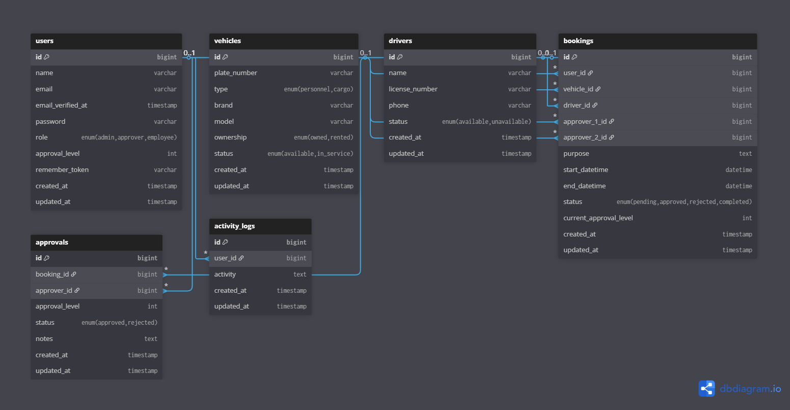

# 🚗 Sistem Pemesanan Kendaraan Perusahaan Tambang

Aplikasi web untuk monitoring dan pemesanan kendaraan perusahaan tambang nikel dengan sistem persetujuan berjenjang.

---

## 📋 Deskripsi Aplikasi

Aplikasi ini dibangun untuk memenuhi kebutuhan perusahaan tambang nikel dalam mengelola:
- **Pemesanan kendaraan** oleh karyawan dengan persetujuan berjenjang (2 level)
- **Manajemen kendaraan** (angkutan orang & barang, milik sendiri & sewa)
- **Manajemen driver/supir**
- **Dashboard monitoring** dengan grafik pemakaian kendaraan
- **Laporan periodik** pemesanan yang dapat di-export ke Excel
- **Activity log** pada setiap proses

---

## 🔧 Tech Stack

| Komponen | Teknologi | Versi |
|----------|-----------|-------|
| **PHP** | PHP | ^8.2 |
| **Framework** | Laravel | ^12.0 |
| **Frontend** | React + TypeScript | ^19.2.0 |
| **Build Tool** | Vite | ^7.0.4 |
| **CSS Framework** | Tailwind CSS | ^4.0.0 |
| **Database** | MySQL / SQLite | - |
| **Export Excel** | Maatwebsite Excel | ^3.1 |
| **Server-Side Rendering** | Inertia.js | ^2.0 |

---

## 👤 Daftar User & Kredensial

| Role | Email | Password | Keterangan |
|------|-------|----------|------------|
| **Admin** | `admin@nikelku.id` | `password` | Dapat menginput pemesanan, menentukan driver & approver |
| **Approver Level 1** | `supervisor@nikelku.id` | `password` | Supervisor - persetujuan tingkat pertama |
| **Approver Level 2** | `manager@nikelku.id` | `password` | Manager - persetujuan tingkat kedua |
| **Employee** | `ahmad.fauzi@nikelku.id` | `password` | Karyawan (contoh) |
| **Employee** | `siti.nurhaliza@nikelku.id` | `password` | Karyawan |
| **Employee** | `rudi.hartono@nikelku.id` | `password` | Karyawan |

---

## 🚀 Panduan Instalasi

### Prasyarat
- PHP >= 8.2
- Composer
- Node.js >= 18
- NPM / Yarn
- MySQL / SQLite

### Langkah Instalasi

1. **Clone repository**
   ```bash
   git clone https://github.com/andhikadk/smi-test
   cd smi-test
   ```

2. **Install dependencies PHP**
   ```bash
   composer install
   ```

3. **Install dependencies Node.js**
   ```bash
   npm install
   ```

4. **Konfigurasi environment**
   ```bash
   cp .env.example .env
   php artisan key:generate
   ```

5. **Konfigurasi database** di file `.env`
   ```env
   DB_CONNECTION=mysql
   DB_HOST=127.0.0.1
   DB_PORT=3306
   DB_DATABASE=vehicle_booking
   DB_USERNAME=root
   DB_PASSWORD=
   ```

6. **Jalankan migrasi dan seeder**
   ```bash
   php artisan migrate --seed
   ```

7. **Jalankan aplikasi (Development)**
   ```bash
   composer dev
   ```
   
   Atau jalankan terpisah:
   ```bash
   # Terminal 1 - Backend
   php artisan serve
   
   # Terminal 2 - Frontend
   npm run dev
   ```

8. **Akses aplikasi**
   
   Buka browser dan akses: `http://localhost:8000`

---

## 📖 Panduan Penggunaan

### 1. Login sebagai Admin
- Login dengan `admin@nikelku.id` / `password`
- Admin dapat:
  - Melihat dashboard dengan grafik pemakaian kendaraan
  - Membuat pemesanan kendaraan baru
  - Memilih kendaraan yang tersedia
  - Memilih driver yang tersedia
  - Menentukan 2 level approver untuk setiap pemesanan
  - Mengelola data kendaraan dan driver
  - Export laporan pemesanan ke Excel

### 2. Login sebagai Approver
- Login sebagai Supervisor (`supervisor@nikelku.id`) - Approver Level 1
- Login sebagai Manager (`manager@nikelku.id`) - Approver Level 2
- Approver dapat:
  - Melihat daftar pemesanan yang perlu disetujui
  - Menyetujui atau menolak pemesanan dengan catatan
  - Pemesanan yang disetujui Level 1 akan dilanjutkan ke Level 2

### 3. Alur Persetujuan Berjenjang
```
Employee Request → Approver L1 (Supervisor) → Approver L2 (Manager) → Completed
                        ↓                           ↓
                    Rejected                    Rejected
```

---

## 📊 Fitur Aplikasi

| Fitur | Deskripsi |
|-------|-----------|
| ✅ Dashboard | Grafik pemakaian kendaraan (line chart, bar chart) |
| ✅ Pemesanan Kendaraan | CRUD pemesanan dengan pilihan kendaraan & driver |
| ✅ Persetujuan Berjenjang | Minimal 2 level persetujuan |
| ✅ Manajemen Kendaraan | Kelola kendaraan (personnel/cargo, owned/rented) |
| ✅ Manajemen Driver | Kelola data supir/driver |
| ✅ Export Excel | Laporan periodik dapat di-export |
| ✅ Activity Log | Log setiap aktivitas dalam sistem |
| ✅ Responsive UI | Tampilan responsif untuk berbagai device |

---

## 🗃️ Struktur Database

### Physical Data Model



---

## 📈 Activity Diagram - Pemesanan Kendaraan

```
┌─────────┐                                                           
│  Start  │                                                           
└────┬────┘                                                           
     ▼                                                                
┌─────────────────────────────────┐                                   
│ Admin membuat pemesanan baru    │                                   
│ (pilih kendaraan, driver,       │                                   
│  approver L1 & L2, tujuan)      │                                   
└─────────────┬───────────────────┘                                   
              ▼                                                       
┌─────────────────────────────────┐                                   
│ Sistem menyimpan booking        │                                   
│ Status: PENDING                 │                                   
│ Current Level: 1                │                                   
└─────────────┬───────────────────┘                                   
              ▼                                                       
┌─────────────────────────────────┐                                   
│ Approver L1 review pemesanan    │                                   
└─────────────┬───────────────────┘                                   
              ▼                                                       
         ┌────┴────┐                                                  
         │Approve? │                                                  
         └────┬────┘                                                  
        Yes/  │  \No                                                  
       ┌──────┘   └──────┐                                            
       ▼                 ▼                                            
┌──────────────┐  ┌──────────────┐                                    
│ Level → 2    │  │ Status:      │                                    
│ Notif L2     │  │ REJECTED     │─────────┐                          
└──────┬───────┘  └──────────────┘         │                          
       ▼                                   │                          
┌─────────────────────────────────┐        │                          
│ Approver L2 review pemesanan    │        │                          
└─────────────┬───────────────────┘        │                          
              ▼                            │                          
         ┌────┴────┐                       │                          
         │Approve? │                       │                          
         └────┬────┘                       │                          
        Yes/  │  \No                       │                          
       ┌──────┘   └──────┐                 │                          
       ▼                 ▼                 │                          
┌──────────────┐  ┌──────────────┐         │                          
│ Status:      │  │ Status:      │         │                          
│ APPROVED     │  │ REJECTED     │─────────┤                          
└──────┬───────┘  └──────────────┘         │                          
       ▼                                   │                          
┌─────────────────────────────────┐        │                          
│ Booking selesai, status         │        │                          
│ COMPLETED                       │        │                          
└─────────────┬───────────────────┘        │                          
              │◄───────────────────────────┘                          
              ▼                                                       
         ┌────────┐                                                   
         │  End   │                                                   
         └────────┘                                                   
```

---

## 📁 Struktur Folder Utama

```
├── app/
│   ├── Enums/              # UserRole, VehicleType, BookingStatus, dll
│   ├── Http/Controllers/   # Controller untuk setiap modul
│   ├── Models/             # Eloquent Models
│   └── Exports/            # Export Excel classes
├── database/
│   ├── migrations/         # Database migrations
│   └── seeders/            # Data seeder
├── resources/
│   └── js/
│       ├── components/     # React components
│       ├── pages/          # Inertia pages
│       └── layouts/        # Layout components
└── routes/
    └── web.php             # Web routes
```

---

## 📝 Catatan Tambahan

- Semua password default adalah `password`
- Activity log otomatis tercatat pada setiap aksi create/update/delete
- Dashboard menampilkan statistik pemakaian kendaraan per bulan
- Export Excel tersedia untuk laporan pemesanan periodik

---